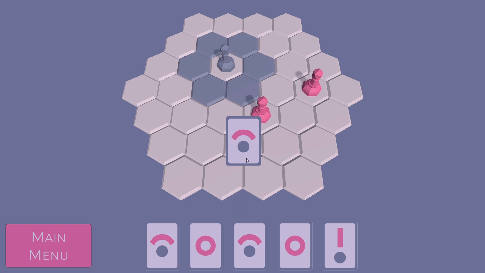

# Hexen

A technical demo for a strategy game involving playing deck cards onto a hexagonal board.

I learned various things while working on this project, including events, hexagonal boards, managing a card deck, and the model-view framework.
Made for the course Platform Development 3 at Howest Digital Arts & Entertainment.

